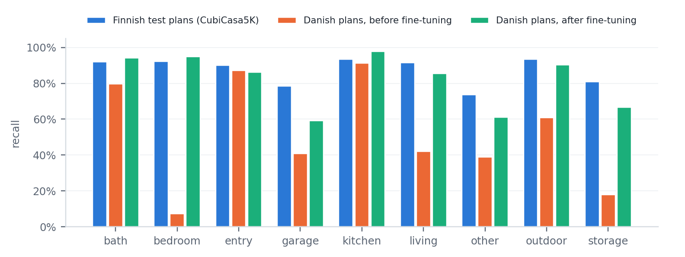
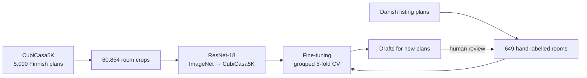
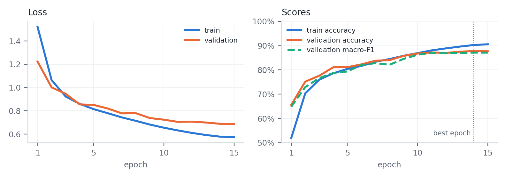

# Room-Type Classifier for Floor Plans


A CNN that predicts the type of each room in a floor plan (kitchen, bedroom, bath, …). It was trained on
public Finnish plans, tested on real Danish listing plans, and adapted to them with a small hand-labelled
dataset. On Danish plans, **accuracy went from 47.8% to 84.3%**.

The interesting part is the **domain shift**. The model scored 86% on Finnish plans but only 48% on Danish
ones, because it had learned to *read* the Finnish room names printed on the plans rather than to
*recognise* the rooms. Fine-tuning on 649 labelled Danish rooms fixed most of it.

## Results

| Model, evaluated on Danish plans | Rooms | Accuracy | Macro-F1 |
|---|---|---|---|
| Published CubiCasa5K model (Kalervo et al., 2019) | 227 | 41.4% | 0.48 |
| ResNet-18 trained on CubiCasa5K (Finnish plans) | 649 | 47.8% | 0.49 |
| ResNet-18 fine-tuned from ImageNet only | 227 | 64.3% | 0.56 |
| ResNet-18 fine-tuned from the CubiCasa5K model, 227 rooms | 227 | 80.2% | 0.74 |
| **ResNet-18 fine-tuned from the CubiCasa5K model, 649 rooms** | **649** | **84.3%** | **0.81** |

Danish figures come from **5-fold cross-validation grouped by house**: every room is predicted by a model
that never saw its house. On the CubiCasa5K test split (4,975 Finnish rooms) the base model reached 85.8%
accuracy and 0.848 macro-F1.



Rooms with drawn fixtures (kitchens, baths, entrances) transfer well. Rooms drawn as empty boxes do not:
bedroom recall dropped to 7% and storage to 18% before fine-tuning. After fine-tuning, bedrooms reach
95%. The remaining errors concentrate on the catch-all class `other` and on garages (only 22 examples).

A second, independent estimate came from model-assisted labelling of 40 new plans: the proposed type
was correct for **84.4%** of the kept room outlines, which matches the cross-validated 84.3%.

## How it works



- **Input:** one room is cut out of its plan with a 15% margin. The surroundings are faded 60% toward
  white, so the network sees doors and neighbouring rooms but knows which room is meant. The crop is
  padded to a square with its proportions kept. The same function is used in training and inference.
- **Model:** ResNet-18 with ImageNet weights and a new 9-class head. Trained with AdamW, a one-cycle
  schedule, mixed precision, class-weighted cross-entropy with label smoothing, and rotation/flip/colour
  augmentation. Predictions average the four 90° rotations of each crop.
- **Evaluation:** macro-F1 alongside accuracy, because the classes are imbalanced. Model selection uses
  the validation split only, and the test split is scored once. On the small Danish set, cross-validation
  is grouped by house so that floors of one listing never appear on both sides.
- **Labelling loop:** the published CubiCasa5K model proposes room outlines and the fine-tuned classifier
  proposes types. A person corrects and accepts each plan, and only accepted plans are used for training.



Classes: `bath` · `bedroom` · `entry` · `garage` · `kitchen` · `living` · `other` · `outdoor` · `storage`.
They follow the grouping used by the CubiCasa5K authors.

## Quick start

```bash
git clone https://github.com/Gabripaglia42/room-type-classifier.git
cd room-type-classifier
python -m venv .venv && source .venv/bin/activate
pip install -r requirements.txt

# data: https://zenodo.org/records/2613548  ->  extract to data/cubicasa5k/
python build_room_dataset.py --data data/cubicasa5k --out data/room_crops
python train_room_classifier.py --data data/room_crops        # ~25 min on an RTX 4050 (6 GB)
```

Labelling your own plans, fine-tuning, the baseline model and the drafting loop are covered in
**[docs/USAGE.md](docs/USAGE.md)**.

## Repository layout

| File | Purpose |
|---|---|
| `build_room_dataset.py` | CubiCasa5K SVG annotations → one crop per room, dataset split kept |
| `train_room_classifier.py` | trains the classifier; learning curves, confusion matrix, error gallery |
| `predict_cubicasa.py` | runs the published CubiCasa5K model (baseline and room outlines) |
| `annotate_rooms.py` | OpenCV tool for drawing, labelling and reviewing rooms |
| `classify_rooms.py` | scores a model on labelled plans; per-plan overlays |
| `finetune_danish.py` | fine-tuning with house-grouped k-fold cross-validation |
| `prelabel_rooms.py` | model-drafted labels for new plans; correction statistics |
| `roomlib.py`, `roomnet.py` | shared code: classes, crop function, label files, networks, transforms |
| `cubicasa_model.py` | CubiCasa5K network definition (third party, CC BY-NC 4.0) |
| `tests/` | unit tests for the crop function and label format (run in CI) |

## Data and licences

- Copyright © 2026 Gabriele Paglia. The code is licensed under the
  [Apache License 2.0](LICENSE): reuse is allowed, but copies and derivative works must keep the
  [NOTICE](NOTICE) file and copyright headers crediting the author, and must state their changes.
  `cubicasa_model.py` is third-party code under CC BY-NC 4.0; see
  [THIRD_PARTY_NOTICES.md](THIRD_PARTY_NOTICES.md).
- To reference this work, use [CITATION.cff](CITATION.cff) (GitHub's "Cite this repository" button).
- No data, images, labels or trained weights are included. CubiCasa5K and its weights are CC BY-NC 4.0,
  so models trained on them are for non-commercial use only. The Danish plans come from public
  real-estate listings and are not redistributed.

## Limitations

- The model classifies rooms; it does not find them. It needs room outlines as input.
- The Danish evaluation set is small (649 rooms, one annotator), so figures carry roughly ±5 points of
  uncertainty, more for rare classes.
- The class `other` groups different room types (utility, technical, office), and a large share of the
  remaining errors fall there.

## Acknowledgements

Built as a learning project during an Erasmus internship, on my tutor's suggestion. It builds on the
CubiCasa5K dataset and model: Kalervo, Ylioinas, Häikiö, Karhu, Kannala, *CubiCasa5K: A Dataset and an
Improved Multi-Task Model for Floorplan Image Analysis*, SCIA 2019.
